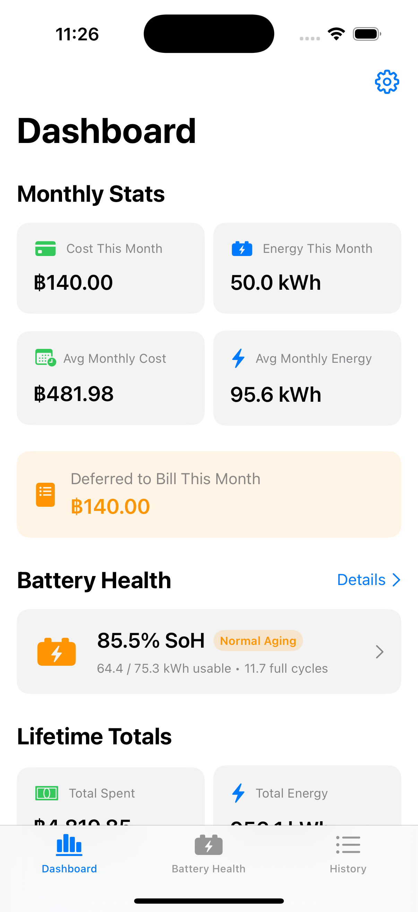
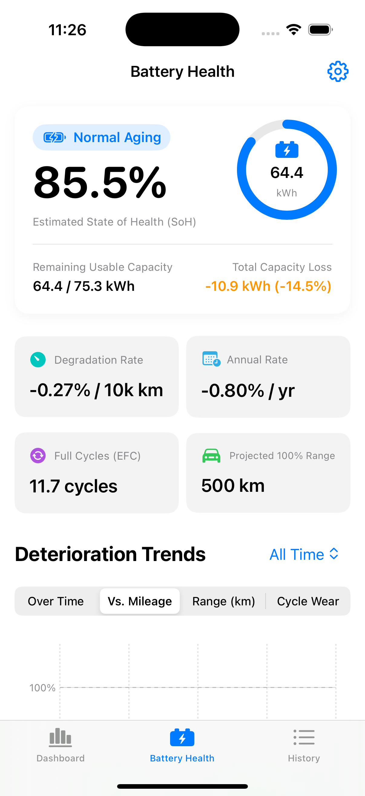
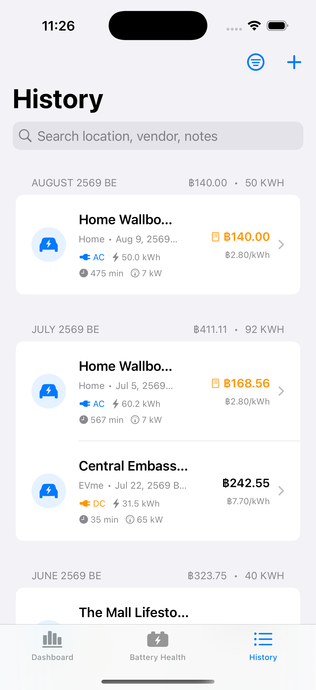
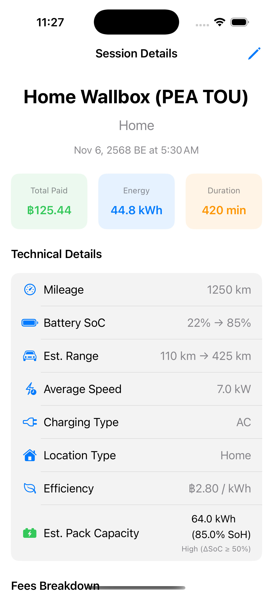
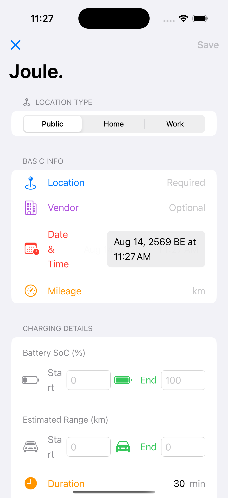
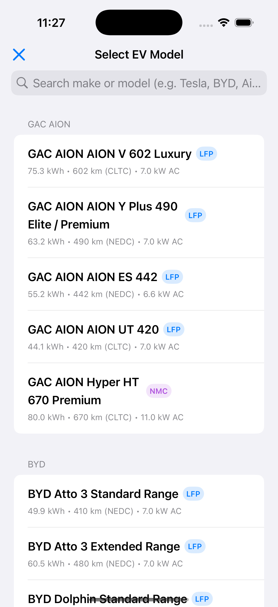

# Joule ⚡️

A modern EV charging log and longitudinal battery health tracker for iOS, iPadOS, and macOS (Mac Catalyst), built with SwiftUI, Swift Charts, Google Sign-In, and Cloud Firestore.

Supports **any electric vehicle (EV)** out of the box with an extensive built-in library of popular vehicle presets (BYD, Tesla, MG, Hyundai, Kia, Volvo, Deepal, ORA, BMW, GAC AION, etc.) and complete custom vehicle configuration.

---

## 📱 App Screenshots

<div align="center">

| **Dashboard Analytics** | **Battery Health Tracker** | **Session History** |
| :---: | :---: | :---: |
|  |  |  |

| **Session Details** | **Smart Charging Form** | **Vehicle Presets & Settings** |
| :---: | :---: | :---: |
|  |  |  |

</div>

---

## ✨ Features

- 🚗 **Universal EV & Battery Chemistry Support**:
  - **EV Preset Library**: One-tap configuration for popular EVs across global brands (BYD Atto 3 / Dolphin / Seal, Tesla Model 3 / Y, MG4 / ZS EV, Hyundai Ioniq 5 / 6, Kia EV5 / EV6, Volvo EX30 / EX40, Deepal S07, ORA Good Cat, GAC AION V / Y, BMW i4 / iX3, etc.).
  - **Chemistry-Aware Analytics**: Tailored algorithms for **LFP** (Blade / Magazine / Lithium Iron Phosphate), **NMC/NCM** (Nickel Manganese Cobalt), **NCA**, and Custom chemistries.
  - **Custom EV Profile**: Freely customize nominal pack capacity, rated range, range testing cycles (WLTP, NEDC, CLTC, EPA), chemistry, expected cycle life to 80% SoH, and AC onboard charger limits.

- 📊 **Comprehensive Dashboard**:
  - Monthly stats (Cost, Energy, Average monthly costs).
  - Driving efficiency calculations (km/kWh, kWh/100km, ฿/km).
  - Interactive Swift Charts (Monthly Cost breakdown, Stacked AC/DC energy, Driving efficiency trends with km/kWh and kWh/100km toggle).
  - Top charging locations with per-unit price analysis.
  
- 🔋 **Battery Health & Longitudinal Analytics**:
  - State of Health (SoH) and usable capacity (kWh) estimation per session with confidence weighting.
  - Least-squares linear regression modeling for degradation rates per 10,000 km and per year.
  - 4 interactive charts: SoH over Time, SoH vs. Mileage, Projected 100% Range (dynamic scaling), and Cycle Wear vs. Chemistry Benchmark.
  - Chemistry-specific battery care advisories (e.g., LFP periodic 100% cell balancing vs. NMC 80% daily charge limits).

- 📜 **Session History & Management**:
  - Grouped chronologically by month with monthly totals.
  - Multi-criteria filters: AC, DC, Home, Public, and Deferred Payments.
  - Full-text search by location, vendor, and notes.
  - Deletion safety with confirmation dialogs.

- ⚡️ **Smart Charging Form**:
  - Auto-estimates home AC charging based on SoC delta ($\Delta\text{SoC}$) and residential tariffs.
  - Support for Thailand PEA/MEA tariffs (Standard Non-TOU, TOU Peak, TOU Off-Peak, Custom).
  - Smart speed handling and inline validation.

- 📁 **CSV Import & Export**:
  - Export entire charging history to standard CSV for backup or external analysis.
  - Resilient importer with header mapping and sanitized number parsing.

- 📱 **Offline-First & Cloud Sync**:
  - **Zero-Friction Launch**: Start logging charges immediately in Local Mode without creating an account or logging in.
  - **Local Persistence**: All data is saved instantly to on-device storage, functioning seamlessly in offline environments (e.g. underground parking garages).
  - **Seamless Cloud Sync**: Sign in with Google anytime from Settings to back up and sync across iPhone, iPad, and Mac. Existing local sessions automatically merge into your cloud account.

---

---

## 🚀 Installation Guide

Choose the installation method that fits your setup:

### 1. Build & Run from Source (macOS, iOS Simulator, or iPhone/iPad)

No paid Apple Developer account is required. You can build and run using a free Apple ID.

1. **Clone the repository**:
   ```bash
   git clone https://github.com/kitmatan/Joule.git
   cd Joule
   ```
2. **Open the project in Xcode**:
   - Open `Joule.xcodeproj` in Xcode 15+.
   - *(Optional)* If modifying `project.yml`, regenerate via `xcodegen generate` (`brew install xcodegen`).
3. **Configure Code Signing**:
   - Select the **Joule** project root in Xcode $\to$ Select the **Joule** target $\to$ **Signing & Capabilities**.
   - Under **Team**, choose your personal Apple ID team.
   - If using a free personal team, change the **Bundle Identifier** to a unique value (e.g. `com.yourname.Joule`).
4. **Run the App**:
   - Select your destination device: **My Mac (Mac Catalyst)**, **iOS Simulator**, or your **connected iPhone / iPad**.
   - Press **Cmd + R** (or click the **Play** button).
   - *Note: Joule starts in Offline/Local Mode immediately with zero configuration needed.*

---

### 2. macOS Direct App Download (`.dmg` / `.zip`)

1. Go to the [Joule GitHub Releases](https://github.com/kitmatan/Joule/releases) page.
2. Download the latest `Joule-macOS-vX.Y.Z.dmg` (or `.zip`).
3. Open the `.dmg` and drag **Joule.app** into `/Applications`.
4. **First Launch (macOS Gatekeeper notice)**:
   - Because open-source builds may not be notarized with an Apple Developer certificate, right-click (or Control-click) `Joule.app` $\to$ click **Open** $\to$ select **Open** in the prompt.
   - Alternatively, remove the quarantine attribute in Terminal:
     ```bash
     xattr -cr /Applications/Joule.app
     ```

---

### 3. iOS Sideloading (`.ipa`)

To install directly on iPhone or iPad without Xcode:

1. Download the latest `Joule-iOS-vX.Y.Z.ipa` from [GitHub Releases](https://github.com/kitmatan/Joule/releases).
2. Install using your preferred sideloading utility:
   - **[AltStore](https://altstore.io/)**: Open AltStore on your device $\to$ `My Apps` $\to$ tap `+` $\to$ select the `.ipa`.
   - **[Sideloadly](https://sideloadly.io/)**: Connect your device to Mac/PC, drag the `.ipa` into Sideloadly, enter your Apple ID, and click **Start**.
   - **[TrollStore](https://github.com/opa334/TrollStore)** / **[LiveContainer](https://github.com/khanld/LiveContainer)**: Open the `.ipa` directly in the app.
3. On iOS, go to **Settings $\to$ General $\to$ VPN & Device Management** and trust your developer certificate if prompted.

---

## 🏷️ Tagging a Release & Publishing to GitHub

For maintainers creating new releases with pre-built Mac `.dmg`/`.zip` and iOS `.ipa` packages:

### Automated CI Release (Recommended)

Pushing a version tag automatically triggers GitHub Actions to build macOS and iOS artifacts and publish them to a new GitHub Release:

```bash
# 1. Commit and push any changes
git add .
git commit -m "Prepare release v1.0.0"
git push origin main

# 2. Create and push a version tag
git tag -a v1.0.0 -m "Release v1.0.0"
git push origin v1.0.0
```
GitHub Actions will build `Joule-macOS-v1.0.0.zip`, `Joule-macOS-v1.0.0.dmg`, and `Joule-iOS-v1.0.0.ipa`, and publish the release automatically.

---

### Local Build & Manual Upload

You can also build the release binaries locally on your Mac using the included build script:

1. **Run the Release Build Script**:
   ```bash
   ./scripts/build_release.sh
   ```
   This generates all distribution packages in the `dist/` directory:
   - `dist/Joule-macOS-v1.0.0.dmg`
   - `dist/Joule-macOS-v1.0.0.zip`
   - `dist/Joule-iOS-v1.0.0.ipa`

2. **Publish with GitHub CLI (`gh`)**:
   ```bash
   gh release create v1.0.0 dist/* --title "Joule v1.0.0" --notes "Initial public release with EV preset catalog, battery health tracking, and offline support."
   ```

3. **Or Publish via GitHub Web Interface**:
   - Go to `https://github.com/kitmatan/Joule/releases/new`
   - Choose or create tag `v1.0.0`.
   - Drag and drop the files from the `dist/` folder into the release assets area.
   - Click **Publish release**.

---

## 🛠️ Cloud Sync Setup (Optional)

Joule works completely standalone in offline mode. If you wish to configure Google Sign-In and Cloud Firestore sync for multi-device backup, follow [FIREBASE_SETUP.md](FIREBASE_SETUP.md):
1. Configure Google Sign-In and download `GoogleService-Info.plist`.
2. Deploy Firestore security rules (`firestore.rules`).

---

## 📄 License
MIT License
